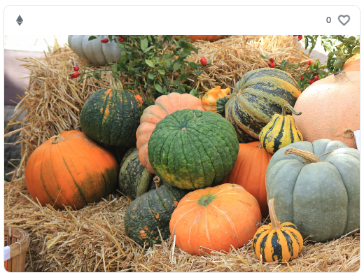

# On-Chain Photo

Fully on-chain NFT of JPEG photo image.  
[OpenSea](https://testnets.opensea.io/ja/collection/onchainphoto),
[Etherscan](https://goerli.etherscan.io/address/0xf564f5B0B09a1E1f93c23a1c8878F541D84ecF60#code)



## Setup

```shell
git clone https://github.com/NowAndNawoo/on-chain-photo.git
cd on-chain-photo
npm ci
cp .env.sample .env
```

.env に必要事項を記入してください。

## Deploy

```shell
npx hardhat run scripts/v3/deploy.ts --network goerli
```

`deployed to:`の後にコントラクトアドレスが表示されます。

## Mint

.env の`V3_CA=`にコントラクトアドレスを記入します。

tokenID を指定して以下のコマンドを実行してください。

```shell
V3_ID=(tokenID) npx hardhat run scripts/v3/mint.ts --network goerli

// tokenID=1 をミントする場合
V3_ID=1 npx hardhat run scripts/v3/mint.ts --network goerli
```

tokenURI を URL エンコードなしで作成する場合は`mintNoEnc.ts`を使ってください。

```shell
V3_ID=(tokenID) npx hardhat run scripts/v3/mintNoEnc.ts --network goerli
```

## Versions

### On-Chain Photo V1

- ストレージにデータを保存(ガス代が高い)
- bytes.concat でデータ結合
- JPG 画像サイズ 〜約 200KB

### On-Chain Photo V2

- SSTORE2 を使用
- bytes.concat でデータ結合
- JPG 画像サイズ 〜約 620KB

### On-Chain Photo V3

- SSTORE2 を使用
- Memory.sol でデータ結合
- JPG 画像サイズ 〜約 720KB

## Links

- [SSTORE2](https://github.com/0xsequence/sstore2)
- [Memory.sol](https://github.com/ethereum/solidity-examples/blob/master/src/unsafe/Memory.sol)
- [cc0.photo](https://cc0.photo/2015/11/14/colorful-pumpkins/)
